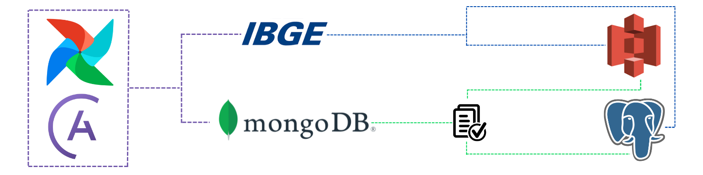

Repositório com Extração de dados via API e mongo utilizando a base de dados do IBGE e PNADC
========

  

*Projeto proposto pela XP EDUCAÇÃO:*

- Extrair dados do IBGE via api;
- Extrair dados de um banco NoSQL (mongodb);
- Fazer o upload desses dados em um S3 da AWS e um banco SQL (postgre)

## Deploy feito local utilizando docker e astro cli (astronomer)

1. Instalar Docker para windowns
2. Como utilizei o windowns foi necessário instalar o Subsistema linux e fazer a ativação de maquina virtual na BIOS
3. Para criar o ambiente utilizando a imagem docker utilizei o [Astro CLI](https://github.com/astronomer/astro-cli)
- Obs: Não esquecer de setar as bibliotecas que serão utilizadas no documento requirements.txt
4. Ao dar start no astro, é criado 4 containers do dockers que rodam localmente na porta 8080
5. Em seguida, criamos a dag e as task's.
6. Nas tasks é onde configuramos as tarefas que serão feitas, como conexão com banco, extração de api e etc.
- Obs: Para não expor a senhas no script, foi utilizado o "Variable" do airflow.models que é setado dentro do login admin
7. Após configurar todas as task's basta no final fazer a orquestração:
- Ex: função extrai precisa vir antes de upload então eu coloco. (extrai >> upload)
- Ex: função transformação precisa vir depois de extrai e antes de upload. (extrai >> transformação >> upload)
